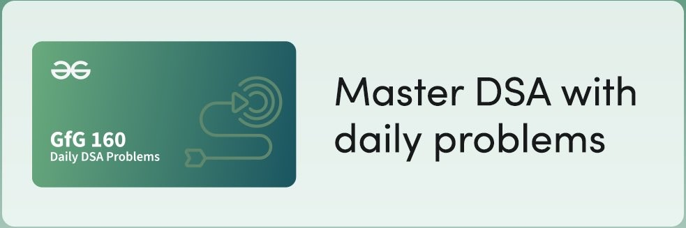

<h1 style="display: flex; align-items: center;">
    
    GfG 160
</h1>

<!-- Arrays Section -->

    

        Arrays
    

    <ul style="margin-left: 20px; margin-top: 5px;">
        <li><a href="https://github.com/imnilesh18/GfG-160---160-Days-of-Problem-Solving/blob/master/01_Arrays/01_Second%20Largest.cpp" style="color: #FFFFFF;">Second Largest</a></li>
        <li><a href="https://github.com/imnilesh18/GfG-160---160-Days-of-Problem-Solving/blob/master/01_Arrays/02_Move%20All%20Zeroes%20to%20End.cpp" style="color: #FFFFFF;">Move All Zeroes to End</a></li>
        <li><a href="https://github.com/imnilesh18/GfG-160---160-Days-of-Problem-Solving/blob/master/01_Arrays/03_Reverse%20an%20Array.cpp" style="color: #FFFFFF;">Reverse an Array</a></li>
        <li><a href="https://github.com/imnilesh18/GfG-160---160-Days-of-Problem-Solving/blob/master/01_Arrays/04_Rotate%20Array.cpp" style="color: #FFFFFF;">Rotate Array</a></li>
        <li><a href="https://github.com/imnilesh18/GfG-160---160-Days-of-Problem-Solving/blob/master/01_Arrays/05_Next%20Permutation.cpp" style="color: #FFFFFF;">Next Permutation</a></li>
        <li><a href="https://github.com/imnilesh18/GfG-160---160-Days-of-Problem-Solving/blob/master/01_Arrays/06_Majority%20Element%20II.cpp" style="color: #FFFFFF;">Majority Element II</a></li>
        <li><a href="https://github.com/imnilesh18/GfG-160---160-Days-of-Problem-Solving/blob/master/01_Arrays/07_Stock%20Buy%20and%20Sell%20%E2%80%93%20Multiple%20Transaction%20Allowed.cpp" style="color: #FFFFFF;">Stock Buy and Sell – Multiple Transaction Allowed</a></li>
        <li><a href="https://github.com/imnilesh18/GfG-160---160-Days-of-Problem-Solving/blob/master/01_Arrays/08_Stock%20Buy%20and%20Sell%20%E2%80%93%20Max%20one%20Transaction%20Allowed.cpp" style="color: #FFFFFF;">Stock Buy and Sell – Max one Transaction Allowed</a></li>
        <li><a href="https://github.com/imnilesh18/GfG-160---160-Days-of-Problem-Solving/blob/master/01_Arrays/09_%20Minimize%20the%20Heights%20I.cpp" style="color: #FFFFFF;">Minimize the Heights I</a></li>
        <li><a href="https://github.com/imnilesh18/GfG-160---160-Days-of-Problem-Solving/blob/master/01_Arrays/10_Kadane's%20Algorithm.cpp" style="color: #FFFFFF;">Kadane's Algorithm</a></li>
        <li><a href="https://github.com/imnilesh18/GfG-160---160-Days-of-Problem-Solving/blob/master/01_Arrays/11_Maximum%20Product%20Subarray.cpp" style="color: #FFFFFF;">Maximum Product Subarray</a></li>
        <li><a href="https://github.com/imnilesh18/GfG-160---160-Days-of-Problem-Solving/blob/master/01_Arrays/12_Max%20Circular%20Subarray%20Sum.cpp" style="color: #FFFFFF;">Max Circular Subarray Sum</a></li>
        <li><a href="https://github.com/imnilesh18/GfG-160---160-Days-of-Problem-Solving/blob/master/01_Arrays/13_Smallest%20Positive%20Missing%20Number.cpp" style="color: #FFFFFF;">Smallest Positive Missing Number</a></li>
    </ul>

<!-- String Section -->

    

        String
    

    <ul style="margin-left: 20px; margin-top: 5px;">
        <li><a href="https://github.com/imnilesh18/GfG-160---160-Days-of-Problem-Solving/blob/master/02_String/01_Implement%20Atoi.cpp" style="color: #FFFFFF;">Implement Atoi</a></li>
        <li><a href="https://github.com/imnilesh18/GfG-160---160-Days-of-Problem-Solving/blob/master/02_String/02_Add%20Binary%20Strings.cpp" style="color: #FFFFFF;">Add Binary Strings</a></li>
        <li><a href="https://github.com/imnilesh18/GfG-160---160-Days-of-Problem-Solving/blob/master/02_String/03_Anagram.cpp" style="color: #FFFFFF;">Anagram</a></li>
        <li><a href="https://github.com/imnilesh18/GfG-160---160-Days-of-Problem-Solving/blob/master/02_String/04_Non%20Repeating%20Character.cpp" style="color: #FFFFFF;">Non Repeating Character</a></li>
        <li><a href="https://github.com/imnilesh18/GfG-160---160-Days-of-Problem-Solving/blob/master/02_String/05_Search%20Pattern%20(KMP-Algorithm).cpp" style="color: #FFFFFF;">Search Pattern (KMP-Algorithm)</a></li>
        <li><a href="https://github.com/imnilesh18/GfG-160---160-Days-of-Problem-Solving/blob/master/02_String/06_Min%20Chars%20to%20Add%20for%20Palindrome.cpp" style="color: #FFFFFF;">Min Chars to Add for Palindrome</a></li>
        <li><a href="https://github.com/imnilesh18/GfG-160---160-Days-of-Problem-Solving/blob/master/02_String/07_Strings%20Rotations%20of%20Each%20Other.cpp" style="color: #FFFFFF;">Strings Rotations of Each Other</a></li>
    </ul>    

<!-- Sorting Section -->

    

        Sorting
    

    <ul style="margin-left: 20px; margin-top: 5px;">
        <li><a href="https://github.com/imnilesh18/GfG-160---160-Days-of-Problem-Solving/blob/master/03_Sorting/01_Sort%200s%2C%201s%20and%202s.cpp" style="color: #FFFFFF;">Sort 0s, 1s and 2</a></li>       
        <li><a href="https://github.com/imnilesh18/GfG-160---160-Days-of-Problem-Solving/blob/master/03_Sorting/02_Find%20H-Index.cpp" style="color: #FFFFFF;">Find H-Index</a></li>
        <li><a href="https://github.com/imnilesh18/GfG-160---160-Days-of-Problem-Solving/blob/master/03_Sorting/03_Count%20Inversions.cpp" style="color: #FFFFFF;">Count Inversions</a></li>
        <li><a href="https://github.com/imnilesh18/GfG-160---160-Days-of-Problem-Solving/blob/master/03_Sorting/04_Overlapping%20Intervals.cpp" style="color: #FFFFFF;">Overlapping Intervals</a></li>
        <li><a href="#" style="color: #FFFFFF;">Insert Interval</a></li>
        <!-- <li><a href="#" style="color: #FFFFFF;">$</a></li> -->
    </ul>

